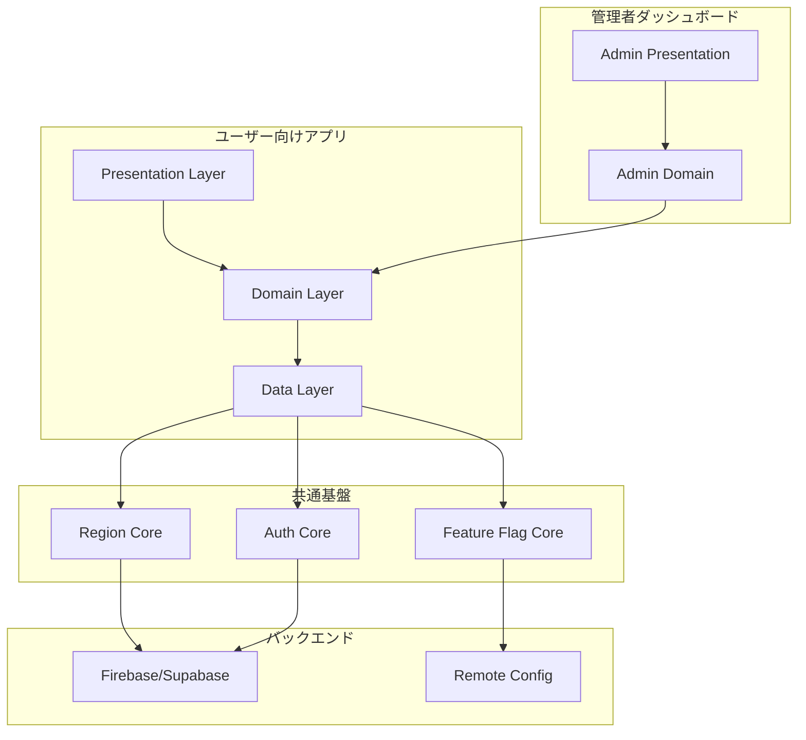
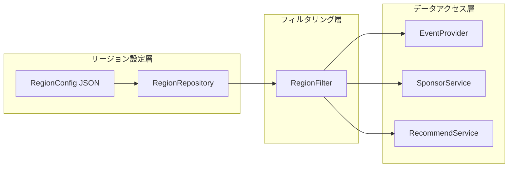
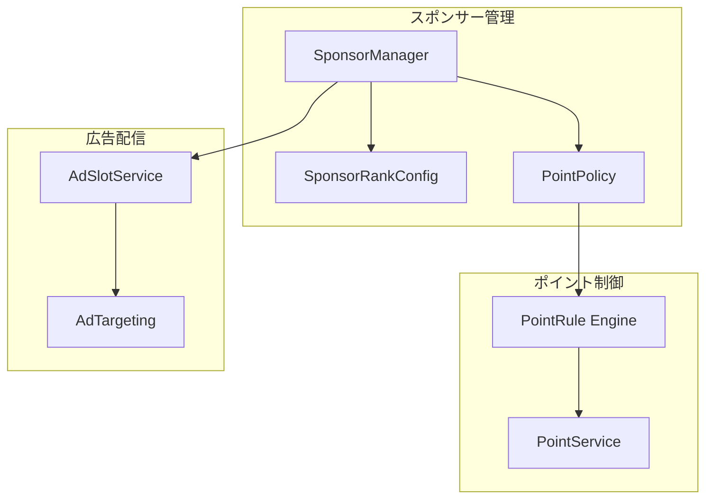
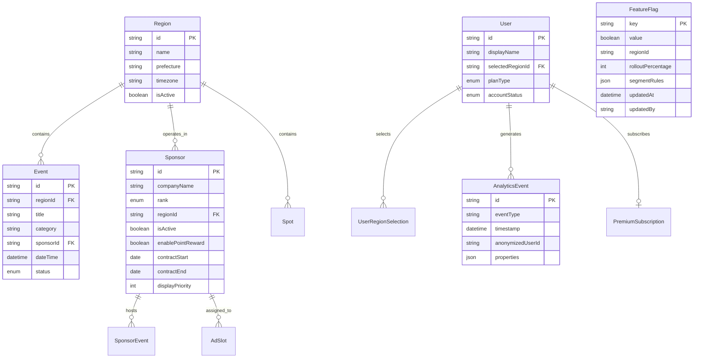

# 技術設計書: ビジネス拡張性 (Business Extensibility)

## Overview

本設計書は「えひめファミリーナビ」にビジネス拡張機能を追加するための技術設計を定義する。設計の最優先事項として以下の2点を据える：

1. **マルチリージョン対応（要件7）**: 他県展開をデータ追加のみで実現する共通機構
2. **スポンサー管理（要件2）**: 企業ランクや協賛有無によるポイント付与制御

既存のFlutter + Riverpod + Hiveアーキテクチャを基盤とし、抽象インターフェースパターン（EventProvider, SponsorService等）を活用して段階的にバックエンド統合を進める。一般ユーザー向けUI/UXは一切変更せず、管理・運用機能は完全に分離する。

### 設計方針

- **データ駆動型リージョン拡張**: リージョン定義をJSON設定ファイル化し、コード変更なしに新地域を追加可能にする
- **スポンサー階層制御**: 企業ランク（Gold/Silver/Bronze）に基づくポイント付与ルールをConfigurationとして外部化
- **抽象化レイヤーの徹底**: 既存のProvider/Serviceパターンを踏襲し、Mock → Backend切り替えをDIで実現
- **管理者機能の完全分離**: 管理者ダッシュボードを独立モジュールとし、ユーザー向けビルドから除外可能な構成

## Architecture

### 全体アーキテクチャ



### レイヤー構成

```
lib/
├── config/                    # 設定・フラグ
│   ├── feature_flags.dart     # 既存（リモート化予定）
│   └── region_config.dart     # リージョン設定定義
├── domain/
│   ├── models/                # ドメインモデル
│   │   ├── event.dart         # 既存
│   │   ├── region.dart        # NEW: リージョンモデル
│   │   ├── sponsor.dart       # NEW: スポンサーモデル
│   │   └── ...
│   └── repositories/          # 抽象インターフェース
│       ├── event_provider.dart       # 既存（リージョン対応拡張）
│       ├── sponsor_service.dart      # 既存（拡張）
│       ├── region_repository.dart    # NEW
│       ├── analytics_service.dart    # NEW
│       └── ...
├── data/
│   ├── mock/                  # モック実装
│   ├── providers/             # DI設定
│   ├── backend/               # NEW: バックエンド実装
│   │   ├── firebase/
│   │   └── supabase/
│   └── local/                 # NEW: ローカルキャッシュ
├── services/                  # アプリケーションサービス
│   ├── region_manager.dart    # NEW
│   ├── sponsor_manager.dart   # NEW
│   └── analytics_engine.dart  # NEW
├── admin/                     # NEW: 管理者機能（完全分離）
│   ├── presentation/
│   ├── domain/
│   └── data/
└── presentation/              # 既存UIレイヤー（変更なし）
```

### マルチリージョン アーキテクチャ（最優先）



**設計の核心**: 全てのデータクエリに `regionId` パラメータを付与し、RegionFilter がデータアクセス時に自動的にリージョンスコープを適用する。新リージョン追加時はJSON設定とデータ投入のみで完了する。

### スポンサー管理 アーキテクチャ（次優先）



**設計の核心**: スポンサーのランク（Gold/Silver/Bronze）ごとにポイント付与ルールを外部設定化。協賛有無のフラグでポイント付与の有効/無効を制御する。

## Components and Interfaces

### 1. RegionRepository（リージョン管理の中核）

```dart
/// リージョン定義
class Region {
  final String id;
  final String name;
  final String prefecture;
  final String timezone;
  final bool isActive;
  final DateTime createdAt;

  const Region({
    required this.id,
    required this.name,
    required this.prefecture,
    required this.timezone,
    required this.isActive,
    required this.createdAt,
  });
}

/// リージョン設定（JSONから読み込み）
class RegionConfig {
  final String defaultRegionId;
  final List<Region> regions;

  const RegionConfig({
    required this.defaultRegionId,
    required this.regions,
  });

  factory RegionConfig.fromJson(Map<String, dynamic> json);
  Map<String, dynamic> toJson();
}

/// リージョンリポジトリ抽象インターフェース
abstract class RegionRepository {
  /// 全有効リージョン一覧取得
  Future<List<Region>> getActiveRegions();
  
  /// リージョンIDで取得
  Future<Region?> getRegionById(String regionId);
  
  /// リージョン追加（管理者用）
  Future<Region> addRegion(Region region);
  
  /// リージョン更新（管理者用）
  Future<void> updateRegion(Region region);
  
  /// リージョン無効化（管理者用）
  Future<void> deactivateRegion(String regionId);
  
  /// デフォルトリージョンID取得
  Future<String> getDefaultRegionId();
}
```

### 2. RegionScopedQuery（リージョンフィルタリング機構）

```dart
/// リージョンスコープを自動適用するクエリラッパー
/// 全データアクセスでリージョン分離を保証する
class RegionScopedQuery<T> {
  final String regionId;
  final Future<List<T>> Function(String regionId) queryFn;

  const RegionScopedQuery({
    required this.regionId,
    required this.queryFn,
  });

  Future<List<T>> execute() => queryFn(regionId);
}

/// リージョン対応EventProvider（既存インターフェースの拡張）
abstract class RegionAwareEventProvider extends EventProvider {
  Future<List<Event>> fetchEventsByRegion({
    required String regionId,
    required FamilyProfile profile,
  });
}
```

### 3. SponsorManager（スポンサー管理の中核）

```dart
/// スポンサーランク
enum SponsorRank {
  gold,    // 最上位: 広告優先表示 + 高ポイント付与
  silver,  // 中位: 通常広告 + 中ポイント付与
  bronze,  // 基本: 限定広告 + 低ポイント付与
}

/// スポンサー情報
class Sponsor {
  final String id;
  final String companyName;
  final SponsorRank rank;
  final DateTime contractStart;
  final DateTime contractEnd;
  final int displayPriority;
  final String regionId;
  final bool isActive;
  final bool enablePointReward;  // 協賛有無でポイント付与制御
  final List<String> associatedEventIds;

  const Sponsor({
    required this.id,
    required this.companyName,
    required this.rank,
    required this.contractStart,
    required this.contractEnd,
    required this.displayPriority,
    required this.regionId,
    required this.isActive,
    required this.enablePointReward,
    required this.associatedEventIds,
  });
}

/// ポイント付与ルール設定（ランク別）
class PointRewardConfig {
  final Map<SponsorRank, int> pointsPerConversion;
  final Map<SponsorRank, int> pointsPerView;
  final Map<SponsorRank, int> maxDailyPoints;

  const PointRewardConfig({
    required this.pointsPerConversion,
    required this.pointsPerView,
    required this.maxDailyPoints,
  });

  factory PointRewardConfig.fromJson(Map<String, dynamic> json);
  Map<String, dynamic> toJson();
}

/// スポンサー管理サービス
abstract class SponsorManager {
  /// スポンサー登録
  Future<Sponsor> registerSponsor(Sponsor sponsor);
  
  /// スポンサー更新
  Future<void> updateSponsor(Sponsor sponsor);
  
  /// スポンサー無効化（60秒以内に広告停止）
  Future<void> deactivateSponsor(String sponsorId);
  
  /// リージョン内アクティブスポンサー一覧
  Future<List<Sponsor>> getActiveSponsorsByRegion(String regionId);
  
  /// スポンサー統計取得
  Future<SponsorStats> getSponsorStats(String sponsorId);
  
  /// ポイント付与判定（ランク + 協賛有無で制御）
  Future<int> calculatePointReward({
    required String sponsorId,
    required String actionType, // 'view', 'click', 'conversion'
  });
}

/// スポンサー統計
class SponsorStats {
  final int impressions;
  final int clicks;
  final int conversions;
  final DateTime lastUpdated;

  const SponsorStats({
    required this.impressions,
    required this.clicks,
    required this.conversions,
    required this.lastUpdated,
  });
}
```

### 4. PointRuleEngine（ポイント制御エンジン）

```dart
/// ポイント付与ルールエンジン
/// 企業ランクと協賛有無に基づいてポイント付与を制御
class PointRuleEngine {
  final PointRewardConfig config;

  const PointRuleEngine({required this.config});

  /// ポイント付与量を算出
  /// enablePointReward = false の場合は 0 を返す
  int calculatePoints({
    required SponsorRank rank,
    required bool enablePointReward,
    required String actionType,
  }) {
    if (!enablePointReward) return 0;

    switch (actionType) {
      case 'conversion':
        return config.pointsPerConversion[rank] ?? 0;
      case 'view':
        return config.pointsPerView[rank] ?? 0;
      default:
        return 0;
    }
  }

  /// 日次上限チェック
  bool isWithinDailyLimit({
    required SponsorRank rank,
    required int currentDailyPoints,
  }) {
    final limit = config.maxDailyPoints[rank] ?? 0;
    return currentDailyPoints < limit;
  }
}
```

### 5. FeatureFlagService（リモートフィーチャーフラグ）

```dart
/// フィーチャーフラグサービス（リモート化）
abstract class FeatureFlagService {
  /// フラグ値取得（キャッシュ付き）
  Future<bool> isEnabled(String flagKey);
  
  /// リージョン別フラグ取得
  Future<bool> isEnabledForRegion(String flagKey, String regionId);
  
  /// フラグ値更新（管理者用）
  Future<void> setFlag(String flagKey, bool value, {String? regionId});
  
  /// パーセンテージロールアウト判定
  Future<bool> isEnabledForUser(String flagKey, String userId);
  
  /// ローカルキャッシュからフォールバック
  bool getLocalFallback(String flagKey);
}
```

### 6. AnalyticsEngine（分析エンジン）

```dart
/// 分析イベント
class AnalyticsEvent {
  final String eventType;
  final DateTime timestamp;
  final String anonymizedUserId;
  final Map<String, dynamic> properties;

  const AnalyticsEvent({
    required this.eventType,
    required this.timestamp,
    required this.anonymizedUserId,
    required this.properties,
  });

  Map<String, dynamic> toJson();
  factory AnalyticsEvent.fromJson(Map<String, dynamic> json);
}

/// 分析エンジン抽象インターフェース
abstract class AnalyticsService {
  /// イベント記録（ローカルキュー追加）
  Future<void> trackEvent(AnalyticsEvent event);
  
  /// バッチ送信（15分間隔 or 100件到達時）
  Future<void> flushEvents();
  
  /// 同意状態管理
  Future<void> setConsentStatus(bool consented);
  
  /// ダッシュボードデータ取得（管理者用）
  Future<AnalyticsDashboardData> getDashboardData({
    required String regionId,
    required int days,
  });
}
```

### 7. BackendService（バックエンド統合）

```dart
/// バックエンドサービス基盤
abstract class BackendService {
  /// 接続状態
  Stream<ConnectionState> get connectionState;
  
  /// オフライン時のローカルキャッシュ読み取り
  Future<T?> getFromCache<T>(String key);
  
  /// データ同期（オンライン復帰時）
  Future<SyncResult> syncWithServer();
  
  /// コンフリクト解決（サーバー側優先）
  Future<void> resolveConflicts(List<ConflictItem> conflicts);
}

/// 同期結果
class SyncResult {
  final int syncedItems;
  final List<ConflictItem> conflicts;
  final DateTime syncTimestamp;

  const SyncResult({
    required this.syncedItems,
    required this.conflicts,
    required this.syncTimestamp,
  });
}
```

### 8. AdminAuthService（管理者認証）

```dart
/// 管理者認証サービス
abstract class AdminAuthService {
  /// 管理者ログイン
  Future<AdminSession> login(String email, String password);
  
  /// セッション検証
  Future<bool> validateSession(String sessionToken);
  
  /// ログアウト
  Future<void> logout();
  
  /// アカウントロック状態確認
  Future<bool> isAccountLocked(String email);
}

/// 管理者セッション
class AdminSession {
  final String sessionToken;
  final String adminId;
  final DateTime expiresAt;
  final DateTime lastActivity;

  const AdminSession({
    required this.sessionToken,
    required this.adminId,
    required this.expiresAt,
    required this.lastActivity,
  });

  bool get isExpired => DateTime.now().isAfter(expiresAt);
  
  bool get isInactive =>
      DateTime.now().difference(lastActivity).inMinutes >= 30;
}
```

## Data Models

### リージョン設定JSON構造（データ追加のみで展開可能）

```json
{
  "defaultRegionId": "ehime",
  "regions": [
    {
      "id": "ehime",
      "name": "愛媛県",
      "prefecture": "愛媛県",
      "timezone": "Asia/Tokyo",
      "isActive": true,
      "createdAt": "2024-01-01T00:00:00Z"
    },
    {
      "id": "kagawa",
      "name": "香川県",
      "prefecture": "香川県",
      "timezone": "Asia/Tokyo",
      "isActive": true,
      "createdAt": "2025-04-01T00:00:00Z"
    }
  ]
}
```

### スポンサーポイント設定JSON構造

```json
{
  "pointRewardConfig": {
    "pointsPerConversion": {
      "gold": 100,
      "silver": 50,
      "bronze": 20
    },
    "pointsPerView": {
      "gold": 5,
      "silver": 3,
      "bronze": 1
    },
    "maxDailyPoints": {
      "gold": 500,
      "silver": 300,
      "bronze": 100
    }
  }
}
```

### データベーススキーマ（Firestore/Supabase共通概念モデル）



### Hiveローカルキャッシュ構造

```dart
/// リージョンキャッシュBox
/// Box名: 'regions'
/// Key: regionId
/// Value: Region JSON

/// イベントキャッシュBox（リージョン別）
/// Box名: 'events_{regionId}'
/// Key: eventId
/// Value: Event JSON

/// スポンサーキャッシュBox（リージョン別）
/// Box名: 'sponsors_{regionId}'
/// Key: sponsorId  
/// Value: Sponsor JSON

/// ユーザー設定Box
/// Box名: 'user_settings'
/// Key: 'selected_region', 'last_sync_time', 'consent_status'

/// 分析イベントキューBox
/// Box名: 'analytics_queue'
/// Key: auto-increment
/// Value: AnalyticsEvent JSON (上限1000件)

/// オフライン書き込みキューBox
/// Box名: 'offline_write_queue'
/// Key: auto-increment
/// Value: PendingWrite JSON
```

