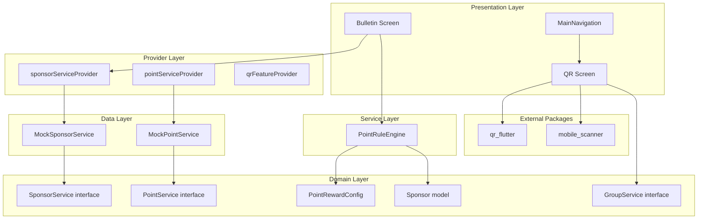

# 技術設計書: QRコード＆ビジネス連携 (QR Business Integration)

## Overview

本設計書は「えひめファミリーナビ」にQRコード画面（生成・スキャン）とビジネス連携機能（スポンサーサービス・ポイントシステム・広告スロット）を追加するための技術設計を定義する。

**設計方針:**
- 既存のFlutter + Riverpod + Hiveアーキテクチャを維持
- 抽象インターフェースパターン（SponsorService, PointService）の既存定義を活用
- フィーチャーフラグによる段階的有効化
- BottomNavigationBar（4タブ）は変更しない
- QRコードへのアクセスはAppBarアクションボタンで提供

**主要パッケージ追加:**
- `qr_flutter: ^4.1.0` — QRコード画像生成
- `mobile_scanner: ^6.0.2` — カメラによるQRコードスキャン

## Architecture

### ディレクトリ構成（追加分）

```
lib/
├── config/
│   └── feature_flags.dart          # enableQrCode追加
├── domain/
│   ├── models/
│   │   ├── sponsor.dart            # NEW: Sponsor, SponsorRank
│   │   └── point_reward_config.dart # NEW: PointRewardConfig
│   └── repositories/
│       ├── sponsor_service.dart    # 既存（変更なし）
│       └── point_service.dart      # 既存（変更なし）
├── data/
│   ├── mock/
│   │   ├── mock_sponsor_service.dart # NEW: SponsorService実装
│   │   └── mock_point_service.dart   # NEW: PointService実装
│   └── providers/
│       └── app_providers.dart      # sponsor/point/qrプロバイダー追加
├── services/
│   └── point_rule_engine.dart      # NEW: ポイント算出ロジック
└── presentation/
    └── qr/
        └── qr_screen.dart          # NEW: QR画面（生成+スキャン）
```

### コンポーネント依存関係



## Components and Interfaces

### 1. Sponsor Model (`domain/models/sponsor.dart`)

```dart
/// スポンサーランク
enum SponsorRank { gold, silver, bronze }

/// スポンサー情報モデル
class Sponsor {
  final String id;
  final String companyName;
  final SponsorRank rank;
  final bool enablePointReward;
  final bool isActive;
  final String regionId;

  const Sponsor({
    required this.id,
    required this.companyName,
    required this.rank,
    required this.enablePointReward,
    required this.isActive,
    required this.regionId,
  });
}
```

### 2. PointRewardConfig Model (`domain/models/point_reward_config.dart`)

```dart
/// ポイント付与設定（ランク別）
class PointRewardConfig {
  final Map<SponsorRank, int> pointsPerConversion;
  final Map<SponsorRank, int> maxDailyPoints;

  const PointRewardConfig({
    required this.pointsPerConversion,
    required this.maxDailyPoints,
  });

  /// デフォルト設定
  static const defaultConfig = PointRewardConfig(
    pointsPerConversion: {
      SponsorRank.gold: 100,
      SponsorRank.silver: 50,
      SponsorRank.bronze: 20,
    },
    maxDailyPoints: {
      SponsorRank.gold: 500,
      SponsorRank.silver: 300,
      SponsorRank.bronze: 100,
    },
  );
}
```

### 3. PointRuleEngine (`services/point_rule_engine.dart`)

```dart
/// ポイント付与ルールエンジン
/// スポンサーランクと協賛有無に基づきポイント付与量を算出する
class PointRuleEngine {
  final PointRewardConfig config;

  const PointRuleEngine({required this.config});

  /// コンバージョン時のポイント算出
  /// enablePointReward=falseの場合は常に0を返す
  /// dailyPointsは当日の既獲得ポイント
  int calculateConversionPoints({
    required SponsorRank rank,
    required bool enablePointReward,
    required int dailyPoints,
  }) {
    if (!enablePointReward) return 0;
    final maxDaily = config.maxDailyPoints[rank] ?? 0;
    if (dailyPoints >= maxDaily) return 0;
    return config.pointsPerConversion[rank] ?? 0;
  }
}
```

### 4. MockSponsorService (`data/mock/mock_sponsor_service.dart`)

既存の`SponsorService`抽象インターフェースを実装し、3件以上のモックスポンサーイベントを返す。各イベントに異なるSponsorRank（Gold, Silver, Bronze）を割り当てる。

### 5. MockPointService (`data/mock/mock_point_service.dart`)

既存の`PointService`抽象インターフェースを実装し、インメモリでポイント残高を管理する。

### 6. QR Screen (`presentation/qr/qr_screen.dart`)

**構成:**
- `DefaultTabController` で「生成」タブと「スキャン」タブを切り替え
- 生成タブ: `DropdownButton`でグループ招待/イベント共有を選択 → `QrImageView`でQR表示
- スキャンタブ: `MobileScanner`でカメラプレビュー表示、スキャン結果をURIパース

**URIスキーム:**
- グループ招待: `ehime-navi://invite/{inviteCode}`
- イベント共有: `ehime-navi://event/{eventId}`

**URIパース処理:**

```dart
/// QRコードURIをパースして適切なアクションを実行
sealed class QrAction {
  const QrAction();
}

class JoinGroupAction extends QrAction {
  final String inviteCode;
  const JoinGroupAction(this.inviteCode);
}

class ViewEventAction extends QrAction {
  final String eventId;
  const ViewEventAction(this.eventId);
}

class InvalidQrAction extends QrAction {
  const InvalidQrAction();
}

/// URI文字列からQrActionにパース
QrAction parseQrUri(String rawValue) {
  final uri = Uri.tryParse(rawValue);
  if (uri == null || uri.scheme != 'ehime-navi') {
    return const InvalidQrAction();
  }
  if (uri.host == 'invite' && uri.pathSegments.isNotEmpty) {
    return JoinGroupAction(uri.pathSegments.first);
  }
  if (uri.host == 'event' && uri.pathSegments.isNotEmpty) {
    return ViewEventAction(uri.pathSegments.first);
  }
  return const InvalidQrAction();
}
```

### 7. AdSlot Logic（掲示板スポンサーカード挿入）

```dart
/// イベントリストにスポンサーカードを挿入する
/// 5件の通常イベントごとに1件のスポンサーイベントを挿入する
List<dynamic> interleaveWithAdSlots({
  required List<Event> events,
  required List<SponsorEvent> sponsorEvents,
}) {
  final result = <dynamic>[];
  int sponsorIndex = 0;
  for (int i = 0; i < events.length; i++) {
    result.add(events[i]);
    if ((i + 1) % 5 == 0 && sponsorIndex < sponsorEvents.length) {
      result.add(sponsorEvents[sponsorIndex]);
      sponsorIndex++;
    }
  }
  return result;
}
```

### 8. AppBar QRアクセスボタン

`MainNavigation`のAppBarに`IconButton(icon: Icon(Icons.qr_code_2))`を追加。`FeatureFlags.enableQrCode`がtrueの場合のみ表示し、タップでQR画面にナビゲートする。

## Data Models

### QR URI スキーム

| タイプ | フォーマット | 例 |
|--------|-------------|-----|
| グループ招待 | `ehime-navi://invite/{inviteCode}` | `ehime-navi://invite/FAM123` |
| イベント共有 | `ehime-navi://event/{eventId}` | `ehime-navi://event/evt_001` |

### モックスポンサーデータ

```dart
// MockSponsorServiceが返すデフォルトデータ
[
  SponsorEvent(
    eventId: 'sp_evt_001',
    sponsorName: '今治タオル工業組合',
    pointReward: 100,
    event: Event(/* Gold rank sponsor event */),
  ),
  SponsorEvent(
    eventId: 'sp_evt_002',
    sponsorName: 'しまなみ観光協会',
    pointReward: 50,
    event: Event(/* Silver rank sponsor event */),
  ),
  SponsorEvent(
    eventId: 'sp_evt_003',
    sponsorName: '道後温泉旅館協同組合',
    pointReward: 20,
    event: Event(/* Bronze rank sponsor event */),
  ),
]
```

## Correctness Properties

*A property is a characteristic or behavior that should hold true across all valid executions of a system — essentially, a formal statement about what the system should do. Properties serve as the bridge between human-readable specifications and machine-verifiable correctness guarantees.*

### Property 1: QR URI round-trip (encode then parse)

*For any* valid event ID string, encoding it as `"ehime-navi://event/{eventId}"` and then parsing with `parseQrUri` SHALL produce a `ViewEventAction` containing the original event ID.

*For any* valid invite code string, encoding it as `"ehime-navi://invite/{inviteCode}"` and then parsing with `parseQrUri` SHALL produce a `JoinGroupAction` containing the original invite code.

**Validates: Requirements 2.3, 3.2, 3.3**

### Property 2: Invalid QR codes are rejected

*For any* string that does not match the `ehime-navi://` URI scheme, `parseQrUri` SHALL return an `InvalidQrAction`.

**Validates: Requirements 3.4**

### Property 3: PointRuleEngine returns 0 when enablePointReward is false

*For any* `SponsorRank` and any `dailyPoints` value, calling `calculateConversionPoints` with `enablePointReward=false` SHALL return 0.

**Validates: Requirements 5.3**

### Property 4: PointRuleEngine respects daily maximum

*For any* `SponsorRank`, when `dailyPoints >= maxDailyPoints[rank]`, calling `calculateConversionPoints` with `enablePointReward=true` SHALL return 0.

**Validates: Requirements 5.5, 5.6**

### Property 5: PointRuleEngine returns correct rank-based points within limit

*For any* `SponsorRank` where `dailyPoints < maxDailyPoints[rank]` and `enablePointReward=true`, calling `calculateConversionPoints` SHALL return the configured `pointsPerConversion[rank]` value.

**Validates: Requirements 5.2, 5.4**

### Property 6: AdSlot interleaving inserts sponsors at correct positions

*For any* list of N regular events (N ≥ 5) and a non-empty list of sponsor events, `interleaveWithAdSlots` SHALL insert a sponsor event after every 5th regular event, and the total output length SHALL equal `events.length + min(events.length ~/ 5, sponsorEvents.length)`.

**Validates: Requirements 6.2**

## Error Handling

| シナリオ | 処理 |
|---------|------|
| GroupService.generateInviteCode失敗 | QR画面にエラーメッセージ表示、再試行ボタン提供 |
| カメラ権限拒否 | 設定画面への誘導メッセージ表示 |
| 無効なQRコードスキャン | 「サポートされていないQRコードです」メッセージ表示 |
| SponsorService.fetchSponsorEvents失敗 | スポンサーカード非表示、通常イベントのみ表示 |
| PointService.addPoints失敗 | ポイント加算失敗のSnackBar表示、リトライ不要 |

## Testing Strategy

### テストアプローチ

**Property-Based Tests（プロパティベーステスト）:**
- `dart_check` パッケージを使用（Dart向けプロパティベーステストライブラリ）
- 各プロパティテストは最低100イテレーション実行
- 純粋関数（`parseQrUri`, `PointRuleEngine.calculateConversionPoints`, `interleaveWithAdSlots`）に対して実施

**Unit Tests（ユニットテスト）:**
- MockSponsorService/MockPointServiceの動作確認
- Feature Flag制御の確認
- UIウィジェットテスト（Flutter test framework）

**テスト対象の分類:**
- Property tests: URI parse/encode、PointRuleEngine計算ロジック、AdSlot interleave
- Unit tests: モックサービスの具体的な戻り値、Feature Flag分岐、UIウィジェット構造
- Integration tests: カメラ権限フロー、Feature Flag toggle時のUI更新

### プロパティテスト設定

```dart
// テスト例: Property 1 - QR URI round-trip
// Feature: qr-business-integration, Property 1: QR URI round-trip
test('For any valid eventId, encode then parse produces ViewEventAction', () {
  // 100+ iterations with random event IDs
  forAll(alphanumericStrings, (eventId) {
    final uri = 'ehime-navi://event/$eventId';
    final action = parseQrUri(uri);
    expect(action, isA<ViewEventAction>());
    expect((action as ViewEventAction).eventId, equals(eventId));
  });
});
```
